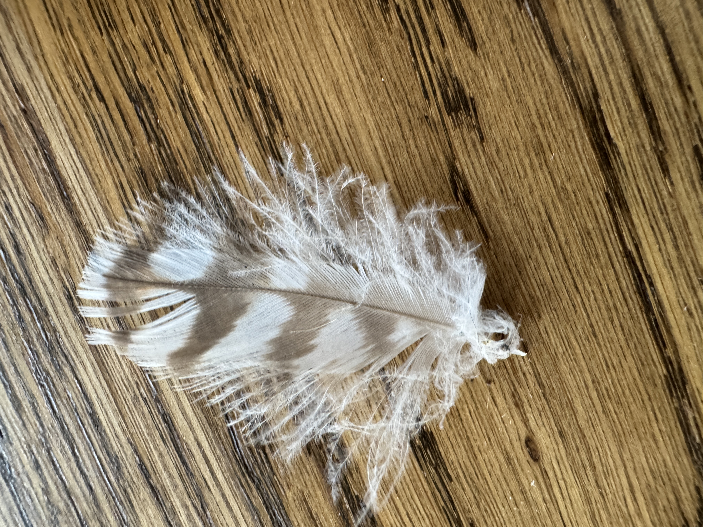
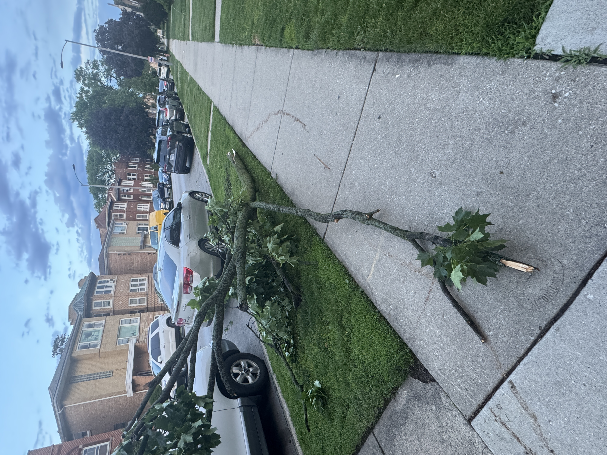
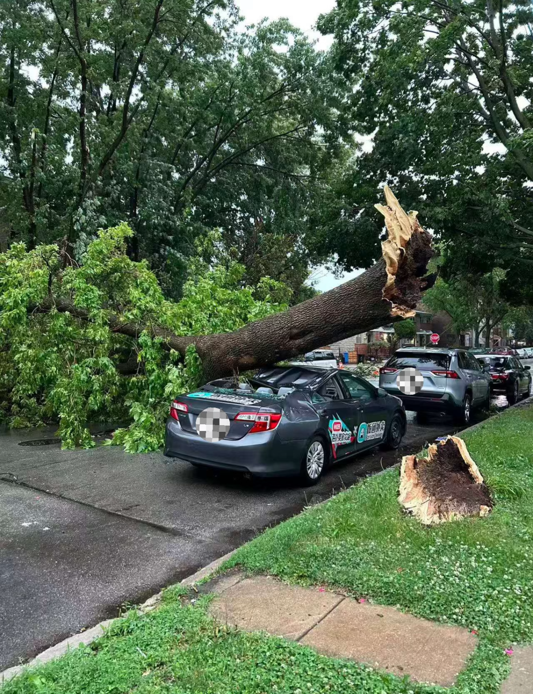
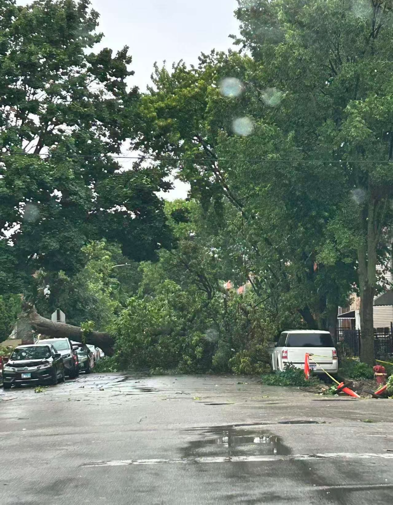
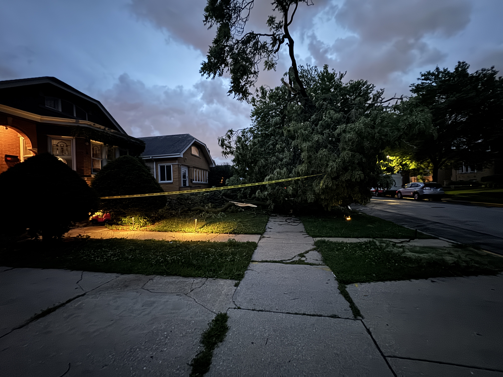
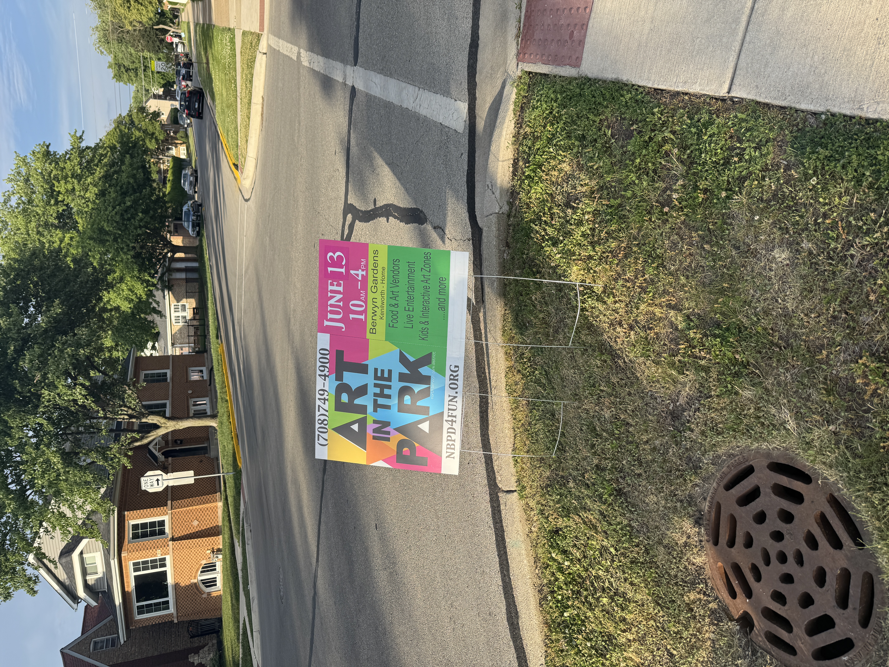
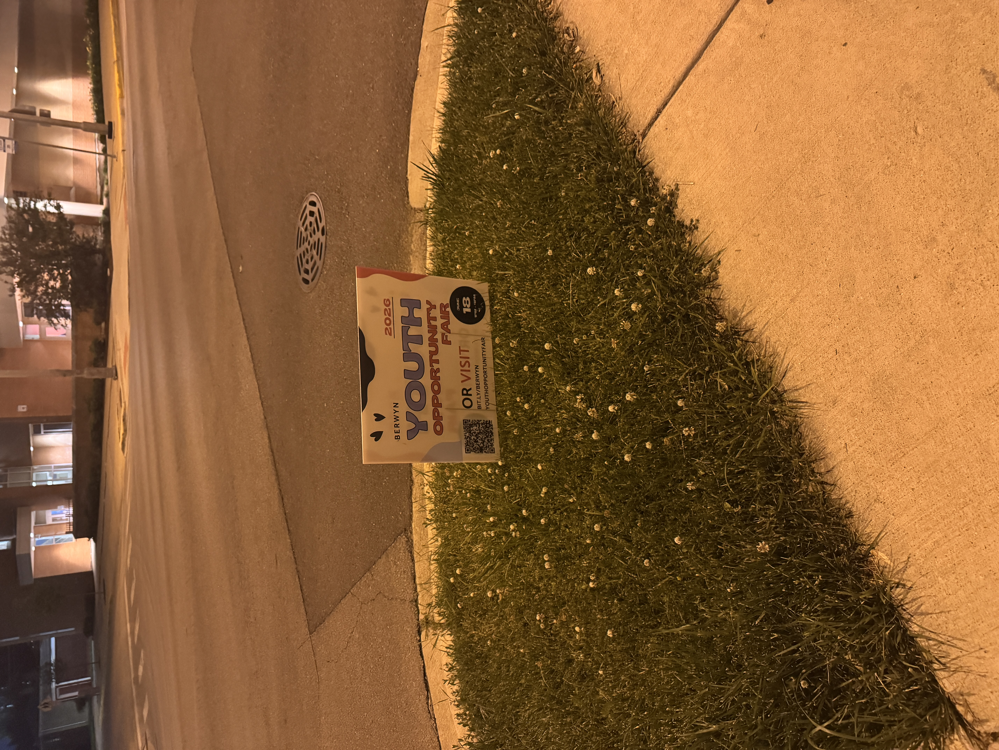

# qr-code-tracking

[metrics.trees4berwyn.org](https://metrics.trees4berwyn.org)

- [qr-code-tracking](#qr-code-tracking)
  - [Design](#design)
  - [2026](#2026)
    - [July Update](#july-update)
      - [The Birds and the Trees](#the-birds-and-the-trees)
      - [2026 Weather is Crazyyy](#2026-weather-is-crazyyy)
      - [Tree Damage from Weather Conditions](#tree-damage-from-weather-conditions)
      - [Comms with Berwyn Tree Canopy Initiative](#comms-with-berwyn-tree-canopy-initiative)
      - [Metrics Updates](#metrics-updates)
      - [Reflections](#reflections)
    - [May Update](#may-update)
      - [Metrics Site Live](#metrics-site-live)
        - [View 2022 Trees on Map](#view-2022-trees-on-map)
        - [Activity](#activity)
      - [Longevity Issues](#longevity-issues)
    - [Software](#software)
    - [Hardware](#hardware)
    - [Deployment Notes](#deployment-notes)
      - [Process](#process)
        - [Prepping Posters](#prepping-posters)
        - [Installing Posters](#installing-posters)
      - [QR Scanning Competitors?!](#qr-scanning-competitors)
      - [Poster Printing Service Comparison](#poster-printing-service-comparison)
    - [Engagement Notes](#engagement-notes)
  - [2025](#2025)
    - [Hardware](#hardware-1)
  - [Also See](#also-see)

## Design 

## 2026

### July Update

#### The Birds and the Trees

Besides shade and general ecosystem strengths, another benefit of trees is absorbing sound; although I live 2 blocks from a main street with small businesses and a moderately busy road, I've never heard a peep from it.

Before 6:00am, there's usually a whole symphony of birds chirping. This is a condensed recording of 17 bird species (house sparrow not included in imgs below) caught using the [AWESOME app Merlin](https://merlin.allaboutbirds.org/), for a mere 10 minute walk in my neighborhood.

https://github.com/user-attachments/assets/0fbb20c4-f4bb-487d-9142-968d5105335e

Personally I like seeing raptor type birds - I've seen 2 Cooper's Hawks and 2 American Kestrals over the past year but they aren't often sighted. Apparently a Bald Eagle was spotted last year in one of Berwyn's tallest trees! 

Chicagoland has some exciting animal situations:

- Just this summer, [2 Bald Eaglets were born for the first time in a century](https://www.chicagotribune.com/2026/07/02/chicagos-first-bald-eaglets/), in Chicago!

- [Chicago has a wild quaker/monk parakeet population](https://www.uchicagomedicine.org/forefront/biological-sciences-articles/escaped-pet-parrots-naturalized-in-23-states), due to escaped/released pets from the 50's - 60's.
  - I have a blue Quaker parrot named Frankie! Non-green quaker parrots are recessive colors usually resulting from breeders

- [Chicago released 1000 feral cats in 2021](https://www.theguardian.com/us-news/2021/may/14/chicago-feral-cats-rat-crisis) in the city to help combat rats
  - RIP [Chicago rat hole](https://en.wikipedia.org/wiki/Chicago_rat_hole)

  

<em>Found on 8/10/2025, on the sidewalk behind my house. A contour feather of (likely) a hawk; either Red-Shouldered or Cooper's. Feather identification can be difficult. <a href="https://www.reddit.com/r/FeatherIdentification/comments/1uj4tpg/who_did_this_little_guy_belong_to_western_illinois/">This</a> and <a href="https://www.reddit.com/r/whatsthisbird/comments/1lvtikj/feather_identification/">this</a> are the closest to online postings I've found in reverse img search.</em>

---

#### 2026 Weather is Crazyyy

This year, thanks to El Nino and **rapid** climate change in general, the weather has been very chaotic and not following usual patterns. 

We've had a lot of intermittent rain dumpings and severe thunderstorms. Although we've just recently had a 1-week heat wave (up to 96°F), the heat and temperatures have been fairly low and moderate compared to previous summers. 

The plants are quite happy with all the precipitation!

#### Tree Damage from Weather Conditions

Severe thunderstorms can be destructive for areas with large tree canopys:

<table>
  <tr>
    <td align="center" valign="top" width="25%">
      
    </td>
    <td align="center" valign="top" width="25%">
      
    </td>
    <td align="center" valign="top" width="25%">
      
    </td>
    <td align="center" valign="top" width="25%">
      
    </td>
  </tr>
</table>

Seeing this sort of damage would not necessarily encourage everyone to want to 'plant more trees'.

#### Comms with Berwyn Tree Canopy Initiative

Last week I communicated with the leader of BTCI (Alex), which is a group whose meetings (or meeting notes via email chains) I engage with. Relevant: My tree poster effort predates me coming into contact with BTCI and has continued as my own **extreme ownership** solo project & **prototype** experiment. 

I linked Alex to my [metrics.trees4berwyn.org site](https://metrics.trees4berwyn.org) so he could take a look. He responded enthusiastically and said he would share this with the group to see if they had any ideas for other potential 'hot spots' to put my posters. I'm interested to see what the group comes up with.

I have started paying attention to local outdoor events in order to prepare some posters around the areas beforehand, such as these:

<table>
  <tr>
    <td align="center" valign="top" width="50%">
      
    </td>
    <td align="center" valign="top" width="50%">
      
    </td>
  </tr>
</table>

#### Metrics Updates

- Replaced 77 poster labels
- Removed 2 posters (they didn't have scans and were in poor visibility locations)
- 3 posters were removed from Proksa Park; I added some replacements
  - Assuming this is due to Berwyn's [30 day poster policy](https://codelibrary.amlegal.com/codes/berwyn/latest/berwyn_il/0-0-0-42586).
  - Proksa Park is the 'nice' park, the most well-maintained one I've seen in Berwyn.
  - I care about this because Proksa Park got me a good amount of scans
  - The replacement posters are on the doggy-poo posts this time, much less visible than before. RIP

The new label system seems to be working okay so far with 1 caveat - the old labels need to be completely removed or else the new labels risk not sticking well and coming off with rain/high winds.
  - I realized this pretty early on but some of the initial replacements I did near my house lost some replacement stickers. Luckily the posters furthest away should be fine.

Scans keep trickling in, usually ~0 - 2 per day now. I expect to reach a total of 200+ scans by the end of the month.

#### Reflections

The people who would scan would be:

- Someone who goes on walks
- Someone willing to engage with random posters
- Someone who knows how to use a QR code
- Someone who is a homeowner in Berwyn
- Someone who needs/wants a new tree 

So there is a limited pool of people to engage with.
Year-over-year the pool can change due to new people moving in.

I could probably gain significant boosts by putting posters in some areas of Berwyn I haven't visited, but I want to be conservative with the amount of posters I'm maintaining. 

I got about 30 left, but I think I will keep them for next year's **iterative** effort and reflect on improvements. I'm no Data Scientist(? I think?) but perhaps I can derive some new insights.

### May Update

#### Metrics Site Live

- [https://metrics.trees4berwyn.org](https://metrics.trees4berwyn.org)

##### View 2022 Trees on Map
Added a tree overlay from [Berwyn's 2022 Tree Inventory](https://cityofberwyn.maps.arcgis.com/apps/webappviewer/index.html?id=0376e190e586494998559cfd9c04580d)

##### Activity

Activity overlay based on scan count + experimental timeline - I want to see how engagement changes based on time/day and look for any trends. There isn't enough data for anything conclusive though. Maybe the end of the summer.

#### Longevity Issues

The sun has not been a friend during this process.

With random thunderstorms mixed with intermittent sunny days my QR labels have started to fade, mostly due to UV damage.

I've concluded that I will revisit existing posters. There are 77 installed at the time of this writing.

  - To address the sun issue I ordered ['weatherproof' direct thermal labels](https://www.onlinelabels.com/products/rl940dw?src=mp-482). On the plus side I'll no longer have to trim the label's excess off myself with scissors now that I'm going to be using 3"W x 2"L labels instead of the 4"W x 6"L labels (too much length) I inherited. Though, I really should've done the 4"W. Too late now though! Order has shipped. 📦

  - I also ordered [UV protection spray](https://www.krylon.com/en/products/clear-coatings/uv-resistant-clear-coating.html) that I'll be applying after labels.

On the software side, this means I'll need a 'replace label' feature that plays well with my metrics-viewing site.

  - Might also throw in a 'disabled/removed' feature. I've considered removing a couple posters that probably weren't great spots to begin with.

This wasn't a problem I anticipated & it's somewhat discouraging but it's a solveable problem. I'm glad I didn't install all the posters yet!

### Software

<table>
  <tr>
    <td align="center" valign="top" width="33%">
      
    </td>
    <td align="center" valign="top" width="67%">
      
    </td>
  </tr>
  <tr>
    <td colspan="2" align="center"><em>QR generator site on mobile (left) and metrics-viewing site on desktop (right)</em></td>
  </tr>
</table>

### Hardware

<table>
  <tr>
    <td align="center" valign="top" width="33%">
      
    </td>
    <td align="center" valign="top" width="34%">
      
    </td>
    <td align="center" valign="top" width="33%">
      
    </td>
  </tr>
  <tr>
    <td colspan="3" align="center"><em>All the components together. Using a portable power bank for Pi + printer. Everything in backpack is ~12lbs.</em></td>
  </tr>
</table>

### Deployment Notes

#### Process

##### Prepping Posters

<table>
  <tr>
    <td align="center" valign="top" width="33%">
      
    </td>
    <td align="center" valign="top" width="34%">
      
    </td>
    <td align="center" valign="top" width="33%">
      
    </td>
  </tr>
  <tr>
    <td colspan="3" align="center"><em>Preparing the posters. The adhesive strips are supposedly reusable.</em></td>
  </tr>
</table>

<table>
  <tr>
    <td align="center" valign="top" width="50%">
      
    </td>
    <td align="center" valign="top" width="50%">
      
    </td>
  </tr>
  <tr>
    <td colspan="2" align="center"><em>My favorite install on a dead tree (left) and a custom stamp I bought to increase the perception of my poster's legitimacy (right)</em></td>
  </tr>
</table>

 

##### Installing Posters

<table>
  <tr>
    <td align="center" valign="top" width="50%">
      
    </td>
    <td align="center" valign="top" width="50%">
      
    </td>
  </tr>
  <tr>
    <td colspan="2" align="center"><em>Before heading out, I turn Pi on/off and wait to see hotspot connected. Takes around 30 seconds.</em></td>
  </tr>
</table>

- grab poster
  - print QR label sticker 
    - put sticker on poster 
      - remove adhesive backing on poster
        - install poster via adhesive backing
          - stamp poster with city stamp
            - pack up to next location

#### QR Scanning Competitors?!

  

<em>Back off bro, this is my turf!</em>

 

#### Poster Printing Service Comparison

| Provider | Year | Material | Cost (pre-tax, pre-shipping) | Quantity | Notes |
|----------|------|----------|------------------------------|----------|-------|
| UPrinting | 2026 | 14 pt. Cardstock Gloss | $56.52 | 100 | Included 20 extras |
| NextDayFlyers | 2025 | 100 lb. Paper w/ Gloss | $32.92 | 50 | |

> UPrinting definitely wins this one. The 14 pt. cardstock was thicker and higher-end feeling. It was their cheapest option. Also the 20 freebies was 👌

### Engagement Notes

- First scan came within an hour after first poster install! I was pleased. It made me want to install more posters.
- The average person is going to interact with a poster a max of 1 time. There is no need to complete the tree form more than once.
  - Therefore, I expect to see less traffic over time once every poster is in place (May/June having higher engagement than August/September).
- Posters should face sidewalks for pedestrians, not streets for cars.
- People autopilot around; thinking about ways to grab their attention with future designs.
- Older people probably don't know how to use QR codes.

## 2025

### Hardware

I thought I could use this [thermal receipt printer](https://www.ebay.com/itm/226867836141). The printer has to be able to print via commands from Linux. **ESC POS Command Support** is apparently the identifiable search term here.

  

<em>The setup that would be abandoned</em>

 

Unfortunately I'm a total noob with this stuff. While I was able to get a signal of successful printer recognition from the Pi, the thermal printer was supposedly undervolted. In my ignorance, ended up frying the poor thing.

  

<em>Burning smell followed by the above, on the thermal printer board</em>

 

  

<em>Tried desoldering the part where they melted together. Nope. RIP.</em>

 

  

<em>I thought I could get GPS coordinates via Adafruit Ultimate GPS. But you need satellite signal to get them successful. Otherwise it just waits forever. Who woulda thought; that's gonna be a problem indoors.</em>

 

  

<em>Turns out the thermal receipt printer was unlikely to product good quality QR codes on adhesive paper anyway. Yay, burning money!</em>

 

For now, the design will involve utilizing my phone GPS, since I'm going to need my phone's hotspot for the Pi anyway. I also ended up using an existing, fancy label printer I happened to have access to. [Zebra printers have their own proprietary cmds through ZPL that help you generate QR codes](https://support-new.zebra.com/article/000032617).

  

<em>Not the most lightweight printer option, but useable for experimentation</em>

 

I was able to get the Pi to print via sending commands to the serial connection on the printer and printed a nice 'hello world' (no picture, RIP). And now the rest is non-complex software I'll eventually get around to vibe coding, something something server hosting. Less exciting bits.

## Also See

Checkout my [brainstorming repo](https://github.com/ashfordhill/brainstorm) for detailed information around this project.
