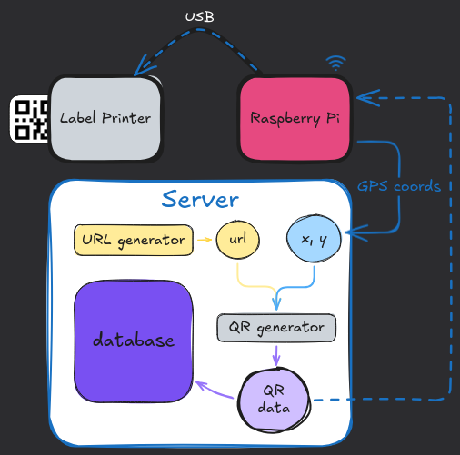
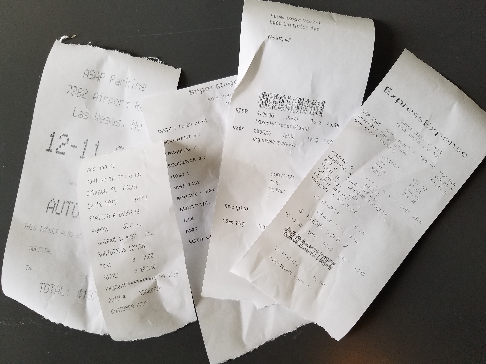
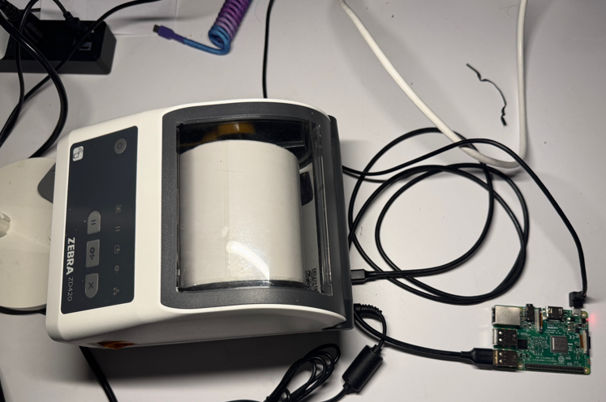

# qr-code-tracking

## Design 

## Hardware

I thought I could use this [thermal receipt printer](https://www.ebay.com/itm/226867836141). The printer has to be able prevent via commands from Linux. **ESC POS Command Support** is apparently the identifiable search term here.

  

<em>The setup that would be abandoned</em>

 

Unfortunately I'm a total noob with this stuff. While I was able to get a signal of successful printer recognition from the PI, the thermal printer was supposedly undervolted. In my ignorance, ended up frying the poor thing.

  

<em>Burning smell followed by the above, on the thermal printer</em>

 

  

<em>Tried unsoldering the part where they melted together. Nope. RIP.</em>

 

  

<em>I thought I could get GPS coordinates via Adafruit Ultimate GPS. But you need satellite signal to get them successful. Otherwise it just waits forever. Who woulda thought; that's gonna be a problem.</em>

 

  

<em>Turns out the thermal receipt printer was unlikely to product good quality QR codes on adhesive paper. Yay, burning money!</em>

 

For now, fallback to phone hotspot + PI and use the phone GPS. I ended up using an existing, fancy label printer I happened to have access to. [Zebra printers have their own proprietary cmds through ZPL that even help you generate QR codes](https://support-new.zebra.com/article/000032617).

  

<em>Not the most lightweight but useable for experimentation</em>

 

I was able to get the PI to via sending commands to the serial connection on the printer and printed a nice 'hello world' (no picture, RIP). And now the rest is non-complex software I'll eventually get around to vibe coding, something something server hosting. Less exciting bits.

## What is the value in this?

### Background Story Time

I [created posters](https://github.com/ashfordhill/make-a-tree-flyer) that contained a QR code & contact information to try and get people to engage with a local government service for tree-planting.

My method for distributing these posters involved me physically going around on walks and leaving posters in random spots. [I bought 100 posters printed in full page color and high-gloss](https://github.com/ashfordhill/make-a-tree-flyer), which cost me about $30.

A lot of questions spawned from this lil venture.

>Which places were worth placing posters to get the most bang for my buck? 

- The blocks with more duplex-style, multi-family homes? 
- The parks?
- In the windows of small businesses?
- The streets with small businesses?

>How would poster design affect engagement levels?

- Did I need a more eye-grabbing header?
- Did my font need a bigger size, different color, different style?
- A good portion of residents are Spanish speaking. Did I still need to account for this? And if so, in which areas? 

> After putting up some posters, the issue of maintainance spawned yet more questions

- Sometimes it rains! Do I need to laminate all my posters? How much does this cost?
  - I did end up laminating most of them with a $30 simple Amazon Basics lamination machine. The process is slow though using a cheap tool like that.
- Is there a way to maybe use magnets or some way to have temporary/swappable poster placements?
- How am I going to update these posters if the QR code website link breaks or I decide I want to change where it redirects to? 
  - Reprinting the posters would be costly, but refreshing the QR code by putting a sticker over the old one would suffice.

Fun questions, but I lacked a **feedback loop** that would give me data I needed. 

### Getting Better Data

There are existing services like [Bitly](https://bitly.com/pages/products/qr-codes) that can be used to help generate QR codes that track metrics within their platform. A  vibe-coded solution for a private server of this type of mechanism could also be whipped up pretty quickly. **But this didn't address all my problems**.

My niche issue here is that I wanted to **dynamically** walk around placing my posters, without pre-planning my walking route. To track each individual poster, I would need to generate a location-based QR code sticker on the spot, to slap on.

**I could also update existing posters** (retrofit? lol) via these means.

### WAIT, is this actually solving anything?! /confusion

If I ONLY used a service like Bitly, **I would need to know in advance** where all my posters were gonna be, and keep my stickers organized before heading out the door to "install" my advertisements, so to speak.

Let's look at what tracking my QR codes would look like if I wanted to just use a service like Bitly to generate my QR Codes and use their system (tracks # of clicks, dates, etc.). 

First, before leaving the house, I generate QR Codes on Bitly for the posters I'm gonna go hang up. This may or may not be volume-batch friendly:
- **QR Code #123** is for Jewel Osco, the grocery store
- **QR Code #124** is for the park's trash can
- **QR Code #125** is for the streetlight on the corner of Main St. and Side Ave.

Then I print the QR stickers and install them each at their locations while I install the posters.

### Issues with software-only solutions like Bitly

- Leaves room for manual error. I might mix up my stickers/notes if I'm not careful and think that the grocery store QR code is getting a bunch of traffic when in reality it was the park one! It's unlikely I would find out the truth later.
- I need to preselect my 'coordinates', file them away in an excel sheet somewhere, or save them under a special name on Bitly's service. **This is inefficient**.
  - Alternatively I could probably find a mobile app to snap my locations as I go, and link them up to specific QR stickers at home later. But this is **also inefficient**.

### First, solve the inefficiency

Since **I have to go to the physical location no matter what** (constraint), why not utilize that fact? 

I personally want to just press a button that will print me a unique trackable QR code sticker. This is solveable and involves **both software and hardware**.

In this way, I don't care that QR Code #123 was for the grocery store. I'm feeding data back from the physical world to the digital world, knowing it is all being pre-organized for me, without needing a manual/human/error-prone middle man for such repetitive work.

### What are some challenges with this approach?

- Getting good GPS data out in the physical world. My main issue here is that using a GPS module like Adafruit Ultimate GPS requires pretty much being outside in order to get a fresh satellite signal for coords. It also isn't the fastest process.
  - Hotspotting from a phone is probably good enough but this is a consideration to make. 
    - If GPS data can be obtained without an internet connection, the QR generating solution would need to have offline capabilities that would then need to be reconnected to online to fully complete the update process.

## General Use Cases

### Coming Back to Bitly

Out of the box, Bitly **does not solve**:

- "Field work"
- Location-based feedback
  - Which neighborhoods/areas are interacting with QR codes, if at all?

### Same-y Situations That Could Benefit

Situations that may be similar to mine:

- Political canvassing posters/signs. These campaigns are running on a budget. Knowing which spots are actually engaging can be helpful. Tracking this data year over year could also be interesting.

- Local happenings like art performances, fairs, special events.

- Businesses trying to get some type of sign-up/engagement on a small scale (do people by the bar engage with QR codes more frequently?)

### Off-topic, thinking like a middleman

Could someone be a Bitly middleman? How?

#### Shipping label brokers

Plenty of businesses don't care to solve all inefficiency issues, leaving to third party business opportunities. For example, the label broker business offers warehouse-friendly, large batch solutions for creating many different shipping labels at once. Places like UPS/USPS/FedEx **do not already have an ideal built-in way to make large volume/batch labels**. They also solve the issue of competitive pricing. 

> UPS/USPS/FedEx **does not care** about keeping track of 'What is the small-time shipping consumer willing to pay today that helps me stay competitive'? These are simply too small of fish to fry. The giant shipping providers care about those massive, large-volume customers. 

Label-brokers like [the Pirate Ship](https://www.pirateship.com/) will offer a good API for bulk label creation for the smaller businesess who need an economic solution to their efficiency problems. Plus they offer competitive shipment label pricing. This is done via becoming a large vendor; all customer shipping labels get grouped under a single vendor name so to a shipping provider (UPS, FedEx, etc.) it looks like The Pirate Ship has the shipping volume of a 'big player'. Big players with consistent high volume of label purchasing get shipping provider discounts & the label broker then passes part of that savings back to customers.

  - ⚠️This is a saturated business and requires up front money to take a loss for competitive label pricing until achieving vendor discounts with shipping giants. Don't do this.

All of that said, I wouldn't be surprised if Bitly didn't offer all desired batch/bulk creation services that some niche areas might want.

## Final musings

QR codes are underutilized IMO. 

What if you could commitment engagement with a fun experiment? Have a scavenger-hunt style promotion! Maybe this even exists already. 

>"Scan all 3 types of QR codes in the area to get promo/freebie! Try and find them all!". 
  - Maybe you have blue, red and green QR codes in multiple places and people need to scan 1 of each to get their prize. Which ones are people paying the most attention to?

What about a little route instead? Get from A to B.

>"Scan this first QR code at the start of this walkway and keep an eye out to scan the QR code at the end! `-insert incentive-` ". 

  - How many people scan the first QR code vs the last one at the 'destination'? Do people stay engaged? Do people make the full route?

Back in olden times, people across all demographics really seemed to enjoy Pokemon Go (yes the hype peak is way over, but still!) which got folks engaging in the physical world using digital tools, in a novel way. 

There's gotta be more to uncover with a generic invention like QR codes, though I'm not quite sure yet. Maybe they already exist but just not here; for example, China might be a valuable place to steal ideas from because their digital integration in society is further along than Western society.

The most exciting thing here is that a single idea can create a lot of spinoffs. 

- Maybe a new physical location of high digital engagement is discovered, thanks to better metrics. 
  - Maybe that means someone would be willing to pay more money to place ads in that hotspot; it now has hard data to back its value. 
    - Could advertising pricing be dynamic based on its live traffic reports, month-to-month? Are there existing tools to help with that?
      -  Etc, etc., can keep springboarding forever. Not necessarily into totally novel ideas, ofc.